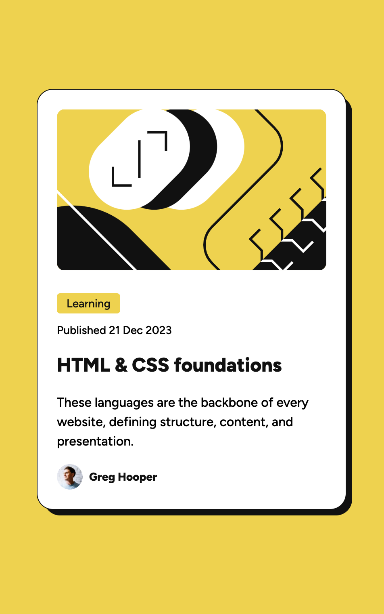

# Frontend Mentor - Blog preview card solution

This is a solution to the [Blog preview card challenge on Frontend Mentor](https://www.frontendmentor.io/challenges/blog-preview-card-ckPaj01IcS). Frontend Mentor challenges help you improve your coding skills by building realistic projects. 

My challenge for this project was to build out this blog preview card component and get it looking as close to the design as possible in only 30 minutes. 

I was able to complete the component in vanilla HTML and CSS in just 29 minutes. Success!

I took another 10 minutes to create this readme and deploy the site to Netlify.

## Overview

### The challenge

Users should be able to:

- See hover and focus states for all interactive elements on the page

### Screenshot

### Links

- Solution URL: [Github Repo](https://blog-preview-card-joekotvas.netlify.com)
- Live Site URL: [Blog Preview Component](https://blog-preview-card-joekotvas.netlify.com)

## Built with

- Semantic HTML5 markup
- CSS custom properties
- Flexbox

## Author

- Website - [Joseph Kotvas](https://www.jokma.com)
- Frontend Mentor - [@joekotvas](https://www.frontendmentor.io/profile/joekotvas)